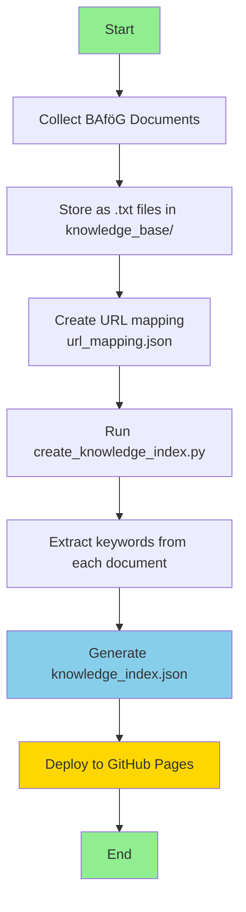
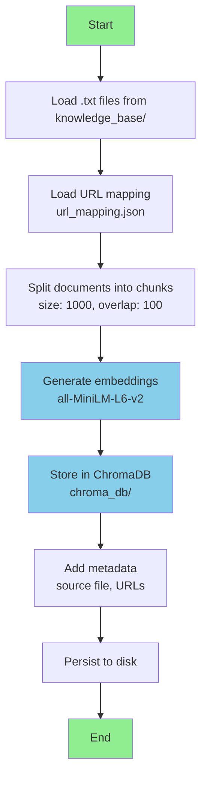
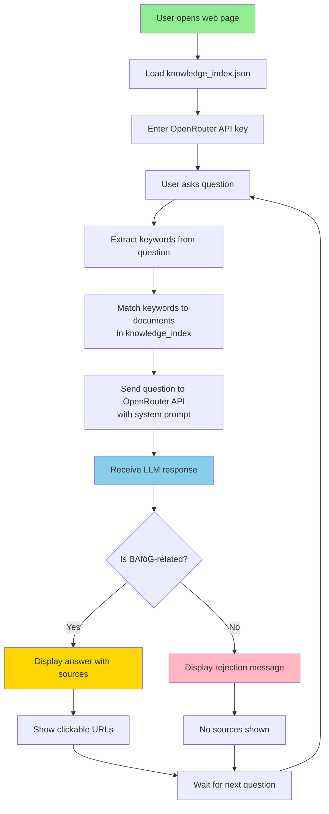
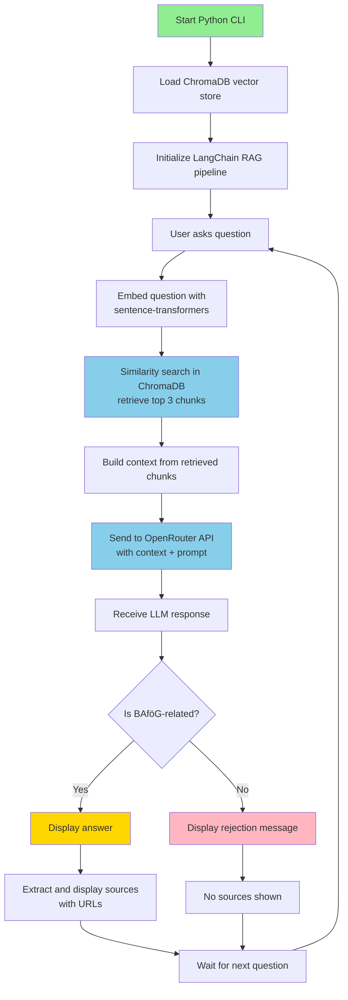

# BAföG RAG Chatbot - Artefact Design

## Overview

This document describes the high-level architecture and design of the BAföG RAG (Retrieval-Augmented Generation) Chatbot. The system provides two modes of operation:

1. **Web Version** - Browser-based client with keyword-based citations
2. **Python CLI Version** - RAG-based system with semantic search using ChromaDB

## System Architecture

```
┌─────────────────────────────────────────────────────────────────┐
│                        BAföG Chatbot System                      │
├─────────────────────────────────────────────────────────────────┤
│                                                                  │
│  ┌──────────────────┐              ┌──────────────────┐        │
│  │   Web Version    │              │  Python CLI      │         │
│  │  (Primary Mode)  │              │   (Advanced)     │         │
│  ├──────────────────┤              ├──────────────────┤        │
│  │ • Static HTML/JS │              │ • ChromaDB       │         │
│  │ • Keyword Match  │              │ • Embeddings     │         │
│  │ • Direct API     │              │ • RAG Pipeline   │         │
│  │ • GitHub Pages   │              │ • LangChain      │         │
│  └────────┬─────────┘              └────────┬─────────┘        │
│           │                                  │                   │
│           └──────────┬──────────────────────┘                   │
│                      │                                           │
│           ┌──────────▼──────────┐                               │
│           │  Knowledge Base     │                               │
│           │  (27+ BAföG docs)   │                               │
│           └─────────────────────┘                               │
│                      │                                           │
│           ┌──────────▼──────────┐                               │
│           │  OpenRouter API     │                               │
│           │  (LLM Service)      │                               │
│           └─────────────────────┘                               │
└─────────────────────────────────────────────────────────────────┘
```

## Knowledge Base Construction

### Web Version - Knowledge Index Creation



**Process:**
1. Documents are collected and stored as text files
2. URL mappings created to link files to source websites
3. Knowledge index script extracts important keywords from each document
4. Index file generated in JSON format for client-side access
5. Static files deployed to GitHub Pages

### Python CLI - Vector Database Construction



**Process:**
1. Documents loaded from knowledge_base directory
2. URL metadata attached from mapping file
3. Documents split into overlapping chunks for better retrieval
4. Each chunk converted to vector embeddings
5. Vectors stored in ChromaDB with metadata
6. Database persisted for future use

## Chatbot Workflow

### Web Version Workflow



**Key Features:**
- Runs entirely in browser (no backend needed)
- Keyword-based document matching for citations
- Direct API calls to OpenRouter
- Client-side filtering for BAföG-only questions
- Mobile responsive design

### Python CLI Workflow



**Key Features:**
- Semantic search using vector embeddings
- More accurate retrieval than keyword matching
- LangChain RetrievalQA pipeline
- Source attribution with URLs
- Offline-capable after initial setup

## Component Details

### Knowledge Base
- **Format**: Plain text files (.txt)
- **Content**: German BAföG information (27+ documents)
- **Metadata**: URL mappings to source websites
- **Size**: Varies per document, typically 1-10 KB

### Web Version Components
- **index.html**: User interface
- **app.js**: Application logic, keyword matching, API calls
- **styles.css**: Responsive styling
- **knowledge_index.json**: Document keywords and metadata

### Python CLI Components
- **knowledge_base_loader.py**: Document processing and vectorization
- **rag_chatbot.py**: RAG pipeline and chat interface
- **main.py**: CLI entry point
- **kb_manager.py**: Knowledge base management tools

### LLM Configuration
- **Provider**: OpenRouter API
- **Default Model**: meta-llama/llama-3.1-8b-instruct
- **Temperature**: 0.7
- **System Prompt**: German language, BAföG-only responses, simplified language

### Embeddings (Python CLI only)
- **Model**: sentence-transformers/all-MiniLM-L6-v2
- **Dimension**: 384
- **Type**: Dense vectors
- **Source**: HuggingFace

### Vector Database (Python CLI only)
- **Technology**: ChromaDB
- **Persistence**: Local disk (chroma_db/)
- **Search Type**: Similarity search
- **Top K**: 3 chunks per query

## Data Flow

### Web Version
```
User Question → Keyword Extraction → Document Matching → 
  → OpenRouter API → LLM Response → Citation Display → User
```

### Python CLI
```
User Question → Embedding → Vector Search → Context Retrieval → 
  → OpenRouter API (with context) → LLM Response → Source Display → User
```

## Deployment

### Web Version
- **Platform**: GitHub Pages (static hosting)
- **Requirements**: None (runs in browser)
- **API Key**: Client-side storage (localStorage)
- **URL**: https://lam1aa.github.io/Chatbot/

### Python CLI
- **Platform**: Local machine
- **Requirements**: Python 3.8+, dependencies from requirements.txt
- **API Key**: .env file
- **Database**: Local ChromaDB storage

## Security & Privacy

### Web Version
- API key stored in browser localStorage
- No server-side data storage
- Direct user-to-OpenRouter communication
- No chat history persistence

### Python CLI
- API key in .env file (not committed)
- Vector database stored locally
- No external data sharing
- Optional chat history in session only

## Scalability Considerations

### Web Version
- ✅ Infinite horizontal scaling (static files)
- ✅ CDN-friendly
- ⚠️ Keyword matching less accurate than embeddings
- ⚠️ Limited to indexed documents

### Python CLI
- ✅ Better retrieval accuracy with embeddings
- ✅ Flexible knowledge base updates
- ⚠️ Single-user per instance
- ⚠️ Requires local resources

## Future Enhancements

1. **Hybrid Search**: Combine keyword + embedding search for web version
2. **Multilingual Support**: UI translation for multiple languages
3. **Conversation History**: Persistent storage with user consent
4. **Advanced Citations**: Highlight relevant excerpts from sources
5. **Feedback Loop**: User ratings to improve responses
6. **Answer Caching**: Cache common questions for faster responses
